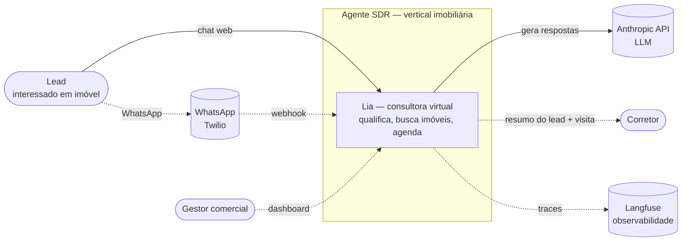
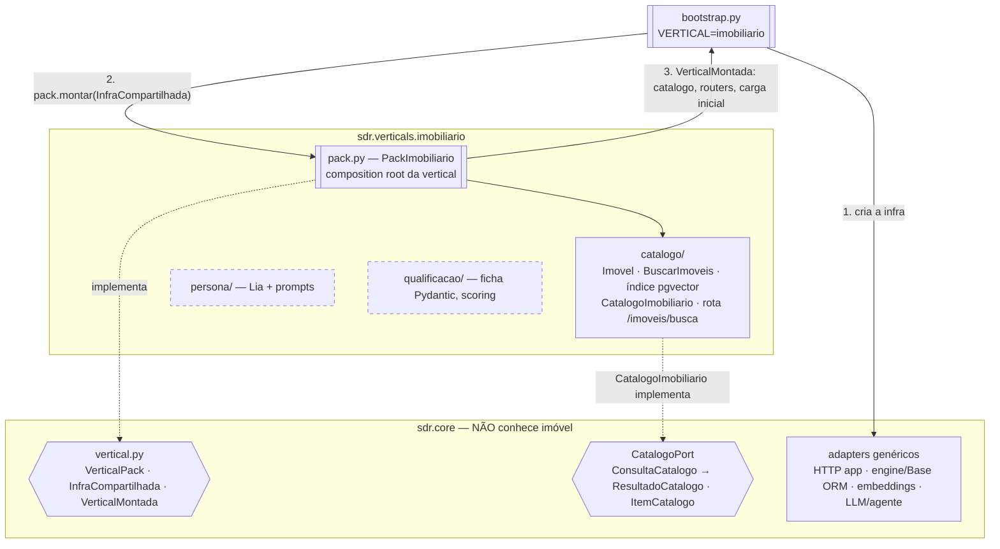
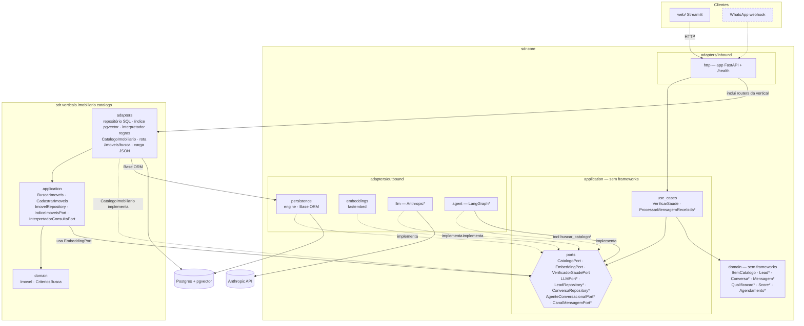
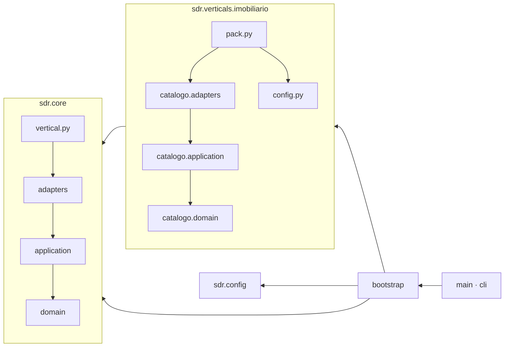
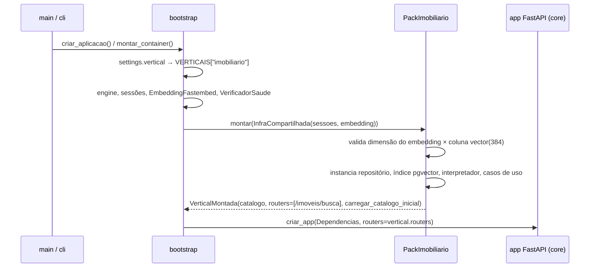
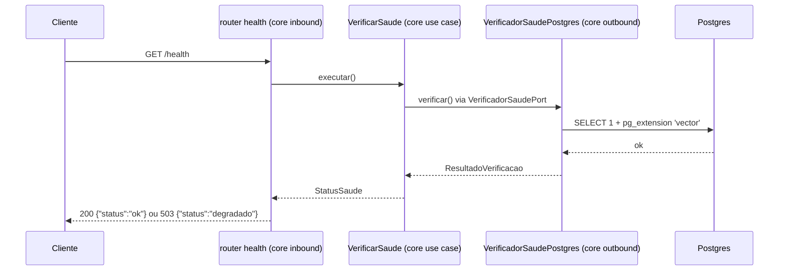
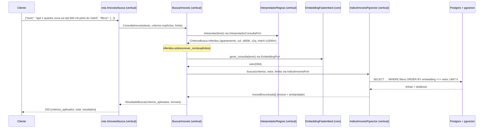
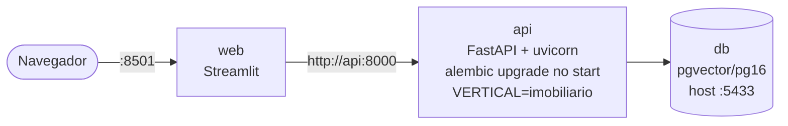

# Arquitetura — Agente SDR Conversacional (vertical imobiliária)

Este documento descreve como o sistema é organizado. Ele se apoia em três decisões:

- **hexagonal (Ports & Adapters):** [ADR 001](adr/001-arquitetura-hexagonal.md);
- **busca híbrida com embeddings locais:** [ADR 002](adr/002-busca-hibrida-embeddings-locais.md);
- **core de SDR genérico separado das verticais de negócio:**
  [ADR 003](adr/003-core-multi-segmento.md).

## 1. Contexto

Quem usa o sistema e com quais sistemas externos ele conversa. Elementos tracejados chegam
nos dias seguintes do cronograma.

## 2. Core genérico × vertical

O **core** sabe fazer SDR conversacional para qualquer segmento: lead, conversa, mensagem,
qualificação, score, agendamento, follow-up e catálogo genérico. A **vertical** ensina o
negócio: o que é o catálogo (imóvel), quais intenções existem, como qualificar e pontuar, e
qual a persona. As duas se encontram no contrato `VerticalPack`.

**Regra entre as árvores:** `verticals → core`, nunca o contrário. O import-linter garante a
regra para imports, e `tests/unit/core/test_core_agnostico.py` garante também para o
vocabulário (nenhum "imóvel", "corretor" ou "metrô" em `core/`).

## 3. Componentes (hexágonos)

Cada árvore é um hexágono: o core inteiro, e cada fatia da vertical (`catalogo/` hoje;
`persona/` e `qualificacao/` depois).

`*` = chega na Etapa C ou depois.

### Regra de dependência

As setas apontam **para dentro** e **para o core**. Os contratos do import-linter
(`.importlinter`) são:

| Contrato | O que impede |
|---|---|
| Camadas globais | `core` importar `verticals`/`bootstrap`; `verticals` importar `config` ou `bootstrap` |
| Core não importa verticals | qualquer import de `sdr.verticals` dentro de `sdr.core` |
| Hexágono do core | `domain` importar `application`, `application` importar `adapters` etc. |
| Vertical imobiliária | fatias importarem `pack`; `catalogo` importar `config` da vertical |
| Hexágono das fatias | o mesmo do core, dentro de `verticals/imobiliario/catalogo` |
| Núcleos puros | domain/application (core e fatias) importarem FastAPI, Pydantic, SQLAlchemy, pgvector… |
| Adapters independentes | `core.adapters.inbound` ⟂ `core.adapters.outbound` |
| Web isolado | Streamlit importar o backend ou o banco |

## 4. Montagem na inicialização

## 5. Fluxo de uma requisição (`GET /health`)

Os próximos fluxos seguem o mesmo desenho: o router só traduz HTTP ↔ caso de uso. A mensagem
de um lead, venha do chat web ou do WhatsApp, vira um `MensagemRecebida` e entra no mesmo
`ProcessarMensagemRecebida`, do core.

## 6. Busca híbrida de imóveis (`POST /imoveis/busca`, rota da vertical)

**Pelo core (Etapa C em diante).** O agente não conhece `/imoveis/busca`: ele usa o
`CatalogoPort`. O `CatalogoImobiliario` valida os filtros (chaves desconhecidas são
rejeitadas), chama o mesmo `BuscarImoveis` e devolve `ItemCatalogo` com `resumo` e
`atributos`.

**Carga inicial.** O caminho é `python -m sdr.cli seed` → `VerticalMontada.carregar_catalogo_inicial` → `CadastrarImoveis`:

1. `ImovelRepository.salvar_todos` faz o upsert;
2. `EmbeddingPort.gerar_documentos(texto_semantico)` gera os vetores;
3. `IndiceImoveisPort.indexar` grava os vetores no índice.

## 7. Implantação local

