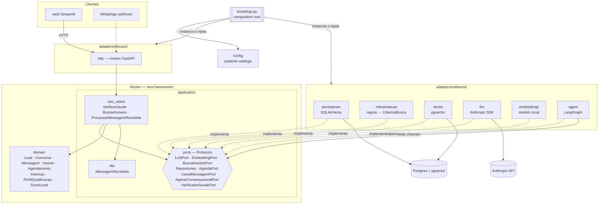
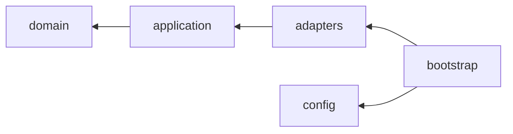
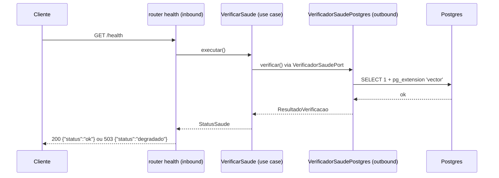
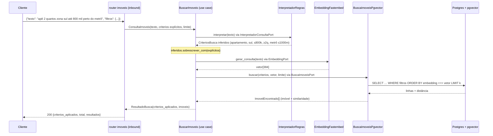
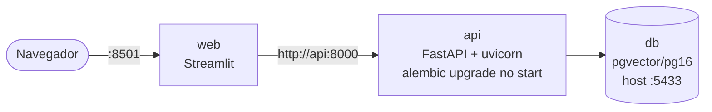

# Arquitetura — Agente SDR Imobiliário

Arquitetura hexagonal (Ports & Adapters). Decisão registrada em
[ADR 001](adr/001-arquitetura-hexagonal.md).

## 1. Contexto

Quem usa o sistema e com quais sistemas externos ele conversa. Elementos tracejados chegam
nos dias seguintes do cronograma.

## 2. Componentes (hexágono)

### Regra de dependência

As setas apontam **para dentro**. O import-linter (`.importlinter`) garante:

| Contrato | O que impede |
|---|---|
| Camadas | `domain` importar `application`, `application` importar `adapters` etc. |
| Núcleo puro | domain/application importarem FastAPI, Pydantic, SQLAlchemy, psycopg, Streamlit… |
| Adapters independentes | `inbound` importar `outbound` (e vice-versa) — só o bootstrap conecta |
| Web isolado | Streamlit importar o backend ou o banco |

## 3. Fluxo de uma requisição (hoje: `GET /health`)

O mesmo desenho vale para os próximos fluxos: o router só traduz HTTP ↔ caso de uso. A
mensagem de um lead, venha do chat web ou do WhatsApp, vira um `MensagemRecebida` e entra no
mesmo `ProcessarMensagemRecebida`.

## 4. Busca híbrida de imóveis (`POST /imoveis/busca`)

Carga: `scripts/seed_imoveis.py` → `CadastrarImoveis` → `ImovelRepository.salvar_todos`
(upsert) → `EmbeddingPort.gerar_documentos(texto_semantico)` → `BuscaImoveisPort.indexar`.

## 5. Implantação local

