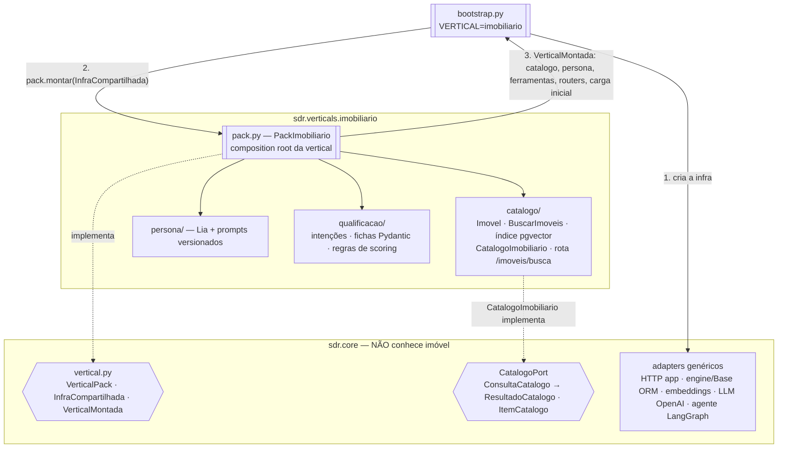
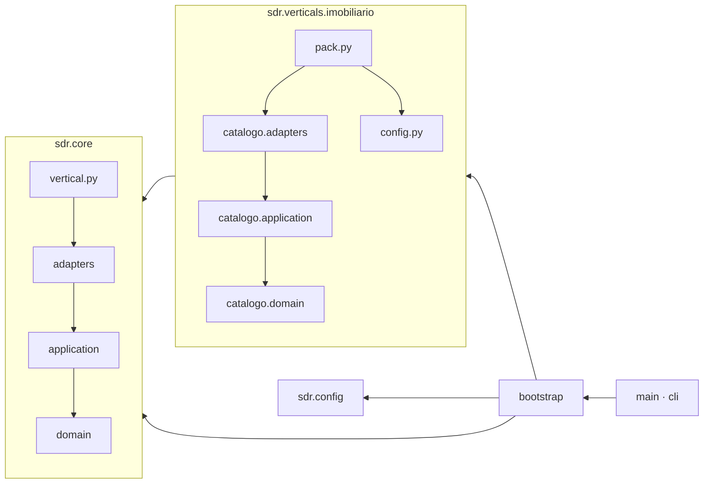
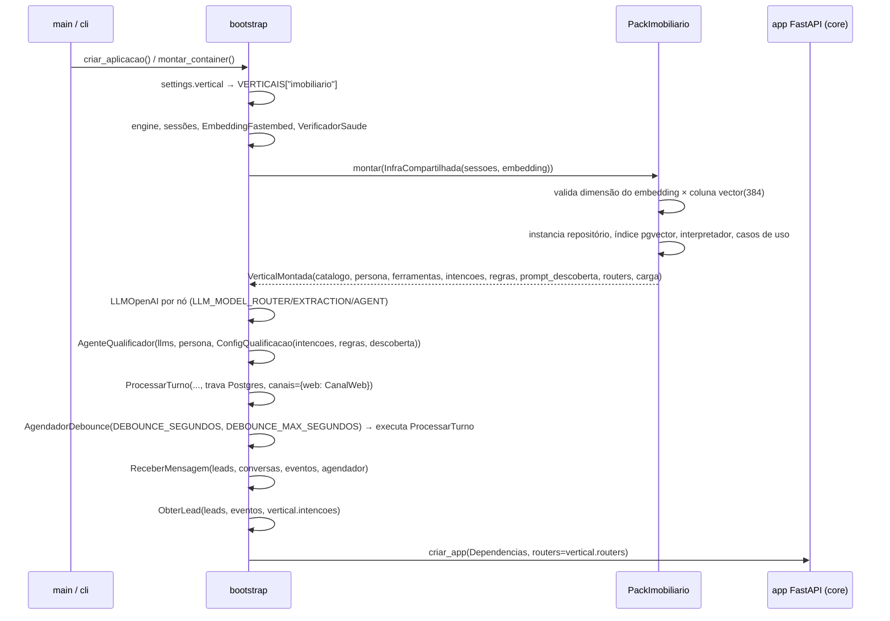
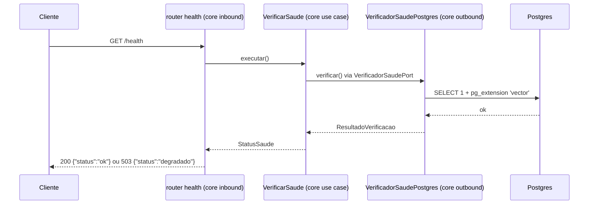
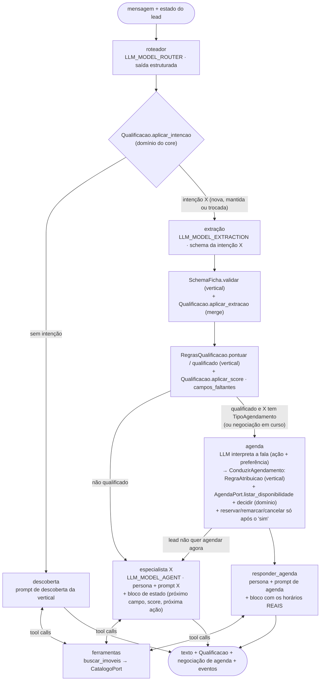
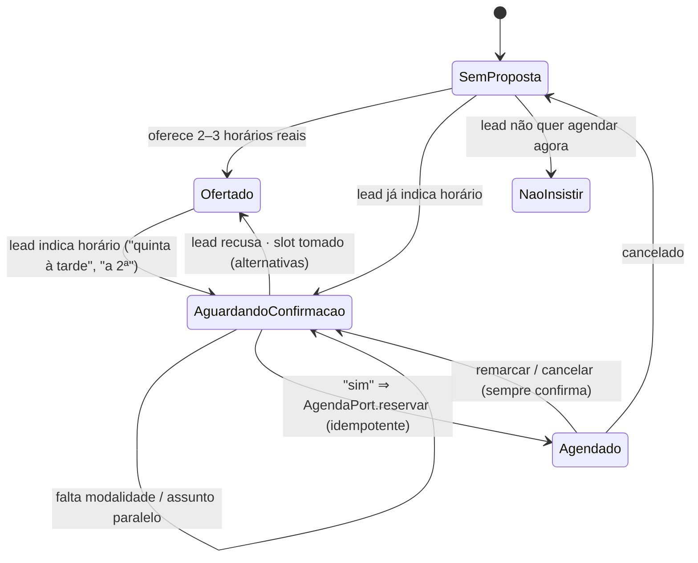
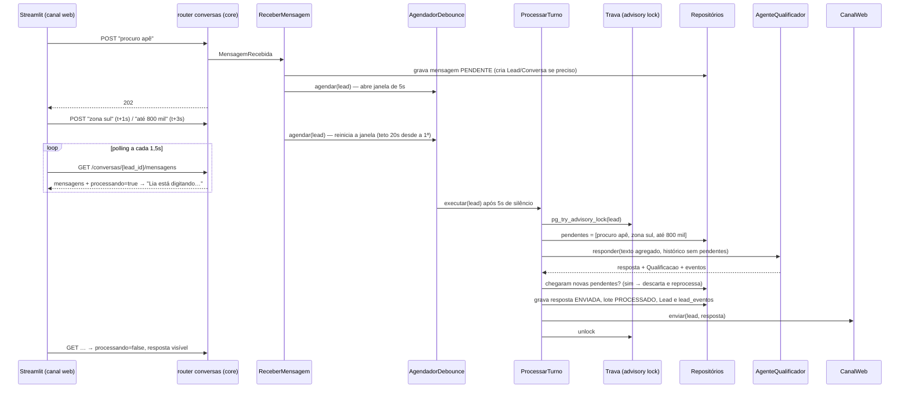
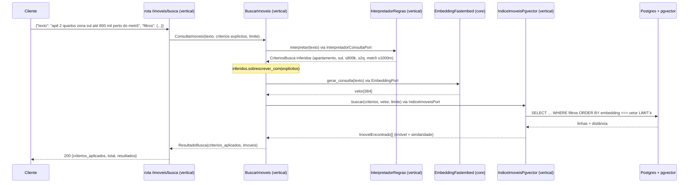
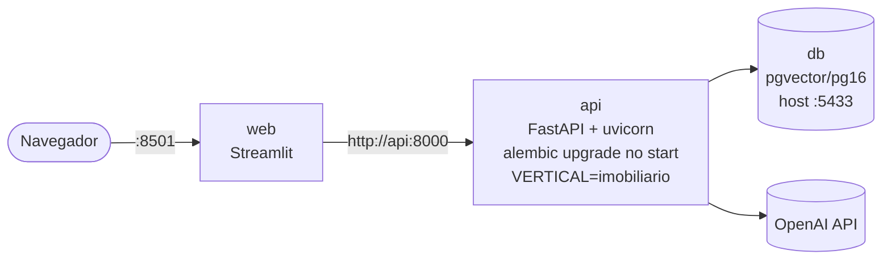

# Arquitetura — Agente SDR Conversacional (vertical imobiliária)

Este documento descreve como o sistema é organizado. Ele se apoia em três decisões:

- **hexagonal (Ports & Adapters):** [ADR 001](adr/001-arquitetura-hexagonal.md);
- **busca híbrida com embeddings locais:** [ADR 002](adr/002-busca-hibrida-embeddings-locais.md);
- **core de SDR genérico separado das verticais de negócio:**
  [ADR 003](adr/003-core-multi-segmento.md);
- **agente com LLM por port, LangGraph como orquestrador e memória no banco:**
  [ADR 004](adr/004-agente-llm-memoria.md);
- **grafo genérico de qualificação (roteador, extração, scoring, especialistas):**
  [ADR 005](adr/005-grafo-qualificacao-multiagente.md);
- **turnos assíncronos com agregação de mensagens (debounce):**
  [ADR 006](adr/006-processamento-assincrono-debounce.md);
- **agendamento (AgendaPort, mock em Postgres, nó de agenda no grafo):**
  [ADR 007](adr/007-agendamento-agenda-mock.md);
- **resumo para o responsável fora do turno, ancorado, e CRMPort:**
  [ADR 008](adr/008-resumo-handoff-crm.md).

## 1. Contexto

Quem usa o sistema e com quais sistemas externos ele conversa. Elementos tracejados chegam
nos dias seguintes do cronograma.


## 2. Core genérico × vertical

O **core** sabe fazer SDR conversacional para qualquer segmento: lead, conversa, mensagem,
qualificação, score, agendamento, follow-up e catálogo genérico. A **vertical** ensina o
negócio: o que é o catálogo (imóvel), quais intenções existem, como qualificar e pontuar, e
qual a persona. As duas se encontram no contrato `VerticalPack`.



**Regra entre as árvores:** `verticals → core`, nunca o contrário. O import-linter garante a
regra para imports, e `tests/unit/core/test_core_agnostico.py` garante também para o
vocabulário (nenhum "imóvel", "corretor" ou "metrô" em `core/`).

## 3. Componentes (hexágonos)

Cada árvore é um hexágono: o core inteiro, e cada fatia da vertical (`catalogo/` hoje;
`persona/` e `qualificacao/` depois).

```mermaid
flowchart TB
    subgraph clientes[Clientes]
        web[web/ Streamlit]
        wpp[WhatsApp webhook]:::futuro
    end

    subgraph core[sdr.core]
        subgraph cin[adapters/inbound]
            http[http — app FastAPI<br/>/health · /conversas · /leads · /leads/&#123;id&#125;]
        end
        subgraph capp[application — sem frameworks]
            cuc[use_cases<br/>ReceberMensagem · ProcessarTurno · ObterHistorico<br/>ListarLeads · ObterLead · RecuperarTurnosPendentes · VerificarSaude<br/>ConduzirAgendamento · GerarResumoHandoff · ObterResumo · ListarAgendamentos]
            cports{{ports<br/>CatalogoPort · EmbeddingPort · LLMPort · Ferramenta<br/>LeadRepository · ConversaRepository · LeadEventoRepository<br/>AgenteConversacionalPort · AgendadorTurnoPort · TravaTurnoPort · CanalMensagemPort<br/>AgendaPort · RelogioPort · CRMPort · RedatorResumoPort · ResumoRepository · PublicadorEventosPort}}
            cferr[ferramentas<br/>FerramentaBuscarCatalogo]
        end
        cdom[domain — sem frameworks<br/>Lead · Conversa · Mensagem · Persona · ItemCatalogo<br/>Qualificacao · Score · EventoLead<br/>Responsavel · Slot · Agendamento · NegociacaoAgenda]
        subgraph cout[adapters/outbound]
            persist[persistence<br/>engine · Base ORM · leads/conversas/mensagens/lead_eventos<br/>AgendaPostgres — mock: responsaveis/slots_agenda/agendamentos<br/>resumos_handoff · CRMPostgresMock — crm_registros + log JSON]
            emb[embeddings<br/>fastembed]
            llm[llm — OpenAI]
            agent[agent — LangGraph<br/>AgenteQualificador]
        end
    end

    subgraph vcat[sdr.verticals.imobiliario.catalogo]
        vdom[domain<br/>Imovel · CriteriosBusca]
        vapp[application<br/>BuscarImoveis · CadastrarImoveis<br/>ImovelRepository · IndiceImoveisPort · InterpretadorConsultaPort]
        vad[adapters<br/>repositório SQL · índice pgvector · interpretador regras<br/>CatalogoImobiliario · rota /imoveis/busca · carga JSON]
    end

    pg[(Postgres + pgvector)]
    openaiapi[(OpenAI API)]

    web -- HTTP --> http
    wpp -.-> http
    http --> cuc --> cports
    cuc --> cdom
    persist -. implementa .-> cports
    emb -. implementa .-> cports
    llm -. implementa .-> cports
    agent -. implementa .-> cports
    agent -- "executa tools" --> cferr
    cferr -- CatalogoPort --> cports

    vad --> vapp --> vdom
    vad -. "CatalogoImobiliario implementa" .-> cports
    vapp -- usa EmbeddingPort --> cports
    vad -- "Base ORM" --> persist
    http -- "inclui routers da vertical" --> vad

    persist --> pg
    vad --> pg
    llm --> openaiapi

    classDef futuro stroke-dasharray: 5 5
```



`*` = chega nos próximos dias do cronograma.

### Regra de dependência



As setas apontam **para dentro** e **para o core**. Os contratos do import-linter
(`.importlinter`) são:

| Contrato | O que impede |
|---|---|
| Camadas globais | `core` importar `verticals`/`bootstrap`; `verticals` importar `config` ou `bootstrap` |
| Core não importa verticals | qualquer import de `sdr.verticals` dentro de `sdr.core` |
| Hexágono do core | `domain` importar `application`, `application` importar `adapters` etc. |
| Vertical imobiliária | fatias importarem `pack`; `catalogo` importar `config` da vertical |
| Hexágono das fatias | o mesmo do core, dentro de `verticals/imobiliario/catalogo` |
| Núcleos puros | domain/application (core e fatias) importarem FastAPI, Pydantic, SQLAlchemy, pgvector… |
| Adapters independentes | `core.adapters.inbound` ⟂ `core.adapters.outbound` |
| Web isolado | Streamlit importar o backend ou o banco |

## 4. Montagem na inicialização



## 5. Fluxo de uma requisição (`GET /health`)



Os próximos fluxos seguem o mesmo desenho: o router só traduz HTTP ↔ caso de uso. A mensagem
de um lead, venha do chat web ou do WhatsApp, vira um `MensagemRecebida` e entra no mesmo
`ReceberMensagem`, do core.

## 6. Grafo de qualificação e agendamento (um turno)



O caso de uso grava a mensagem da Lia, o `Lead` e os eventos em `lead_eventos`. No `Lead`
entram as colunas, as fichas JSONB e a negociação de agenda (`leads.agenda`). O grafo só
escreve na agenda, pelo `AgendaPort`, e somente depois da confirmação explícita do lead
([ADR 007](adr/007-agendamento-agenda-mock.md)).

### Negociação de horário (domínio `decidir`)



### Resumo para o responsável (fora do turno, [ADR 008](adr/008-resumo-handoff-crm.md))

```mermaid
sequenceDiagram
    participant PT as ProcessarTurno
    participant C as CanalMensagemPort
    participant P as PublicadorEventosPort<br/>(asyncio; produção: outbox+fila)
    participant G as GerarResumoHandoff
    participant R as RedatorResumoPort (LLM)
    participant DB as resumos_handoff
    participant CRM as CRMPort (mock → HubSpot)

    PT->>C: envia a resposta da Lia
    PT->>P: publicar(eventos do turno)
    Note over PT: turno termina aqui
    P-->>G: LeadQualificado / AgendamentoCriado / atualização
    G->>G: fatos do lead + impressão digital (igual à última? para)
    G->>R: redigir(fatos, TemplateResumo da vertical)
    R-->>G: rascunho
    G->>G: ancorar (dados do estado; só o que tem lastro; "não informado")
    G->>DB: nova versão
    G->>CRM: cria/atualiza lead + anexa resumo
    G->>G: evento ResumoHandoffGerado
```

## 7. Mensagens do lead → turno → resposta da Lia (assíncrono, [ADR 006](adr/006-processamento-assincrono-debounce.md))



A guarda contra itens inventados (códigos citados conferidos no catálogo, uma correção e
depois o fallback) roda dentro do `ProcessarTurno`, antes da checagem de novas mensagens.

## 8. Estado de qualificação e painel (`GET /leads/{lead_id}`)

```mermaid
sequenceDiagram
    participant W as Streamlit — fragment "painel" (polling 1,5s)
    participant R as router leads (core)
    participant U as ObterLead (core use case)
    participant L as LeadRepository
    participant E as LeadEventoRepository

    W->>R: GET /leads/{lead_id}
    R->>U: executar(Canal.WEB, lead_id)
    U->>L: obter_por_remetente → Lead + Qualificacao (colunas + fichas JSONB)
    U->>U: campos_faltantes(ficha, IntencaoVertical.prioridade_campos)<br/>(intenções da vertical injetadas pelo bootstrap; não persistido)
    U->>E: listar(lead.id) — ordem (ocorrido_em, seq)
    U-->>R: EstadoLead | None
    R-->>W: 200 {intencao, ficha, fichas, campos_faltantes, score, classificacao,<br/>score_motivos, proxima_acao, qualificado_em, eventos} · 404
```

O core não interpreta a ficha: devolve os nomes de campo da vertical. O vocabulário de
exibição (rótulos, emojis, formato em reais) fica no front da vertical (`web/app.py`).
Chat e painel são dois `st.fragment(run_every=1.5s)` em colunas lado a lado; só eles se
redesenham, e o campo de mensagem continua livre.

**Cenários com LLM real** (`make llm`): `tests/llm/test_cenarios.py` lê os roteiros de
`evals/cenarios/*.json`, manda cada fala e espera a resposta, como no chat. Depois confere
o estado final via `GET /leads/{id}` e o painel via `streamlit.testing` (AppTest), sem
olhar o texto da Lia.

## 9. Busca híbrida de imóveis (`POST /imoveis/busca`, rota da vertical)



**Pelo core (agente).** O agente não conhece `/imoveis/busca`: ele usa o
`CatalogoPort`. O `CatalogoImobiliario` valida os filtros (chaves desconhecidas são
rejeitadas), chama o mesmo `BuscarImoveis` e devolve `ItemCatalogo` com `resumo` e
`atributos`.

**Carga inicial.** O caminho é `python -m sdr.cli seed` → `VerticalMontada.carregar_catalogo_inicial` → `CadastrarImoveis`:

1. `ImovelRepository.salvar_todos` faz o upsert;
2. `EmbeddingPort.gerar_documentos(texto_semantico)` gera os vetores;
3. `IndiceImoveisPort.indexar` grava os vetores no índice.

## 10. Implantação local


